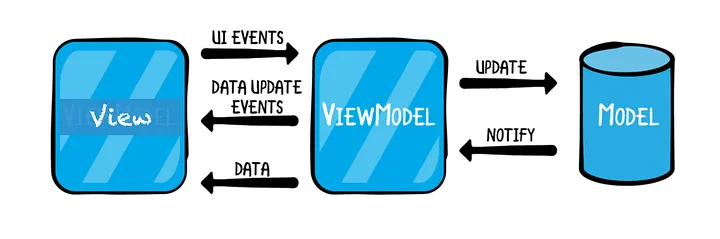

# Free-market-test
Free market test

# Reto MercadoLibre
# Qué es este proyecto?
La app debería contar con tres pantallas:
1. Campo de búsqueda.
2. Visualización de resultados de la búsqueda.
3. Detalle de un producto.
Proyecto
[https://github.com/crisanbe/Free-market-test/blob/dev/README.md].

# Características principales

1. Kotlin
1. MVVM (Modelo-Vista-ViewModel): Patrón de diseño arquitectónico que separa la lógica de presentación de la interfaz de usuario utilizando un ViewModel para manejar la lógica de negocio.
1. Jetpack Compose Biblioteca de Android para la creación de interfaces de usuario declarativas y basadas en componentes
1. MutableStateOf Clase proporcionada por Jetpack Compose para mantener el estado mutable en la interfaz de usuario.
1. UIEvent Patrón de diseño para representar eventos de interfaz de usuario de manera más simple y coherente.
    - Simpler
1. Hilt Marco de inyección de dependencias recomendado por Google para Android. Simplifica la inyección de dependencias en las aplicaciones.
1. Navigation Compose Componente de Jetpack Compose para manejar la navegación entre pantallas en una aplicación.
1. Retrofit Biblioteca de Android para realizar solicitudes de red de manera sencilla y eficiente.
1. Custom Fonts

# Funciones de composición

3. Theming /Modo Oscuro y Claro
4. Fonts
5. Colors
    - creating
7. LazyColumn
8. Rows
9. Columns
10. Scaffold
11. AppBar
12. Circular Progress Indicator

# Pruebas
1. Junit Marco de pruebas unitarias para Java y Kotlin.
2. Mockito Biblioteca de Java para crear objetos simulados (mocks) en pruebas unitarias
3. Jacoco coverage. Herramienta utilizada para medir la cobertura de código en pruebas unitarias

# JaCoCo (Java Code Coverage):
1. JaCoCo es una herramienta de análisis de cobertura de código para proyectos Java. Te permite evaluar qué porcentaje de tu código está siendo ejecutado durante las pruebas, lo que es útil para asegurarse de que las pruebas cubran adecuadamente tu código.
   Integración en Android Studio:
   JaCoCo se integra fácilmente con Gradle (el sistema de construcción de Android).
   Puedes configurar tu proyecto para que las pruebas generen informes de cobertura de código y luego ver los resultados en Android Studio.
    1. Comando ./gradlew koverMergedReport

#  MutableStateOf
1. StateFlow Semántica de Estado:
    1. StateFlow  está diseñado específicamente para representar un estado mutable y proporcionar un flujo de eventos que notifica a los suscriptores cuando el estado cambia. Esto es útil cuando necesitas mantener y compartir un estado mutable en toda tu aplicación. (https://developer.android.com/reference/kotlin/androidx/compose/runtime/MutableState) in viewmodels.

# References
1. https://github.com/android/compose-samples
1. https://developer.android.com/jetpack/compose
1. https://developer.android.com/jetpack/compose/state

